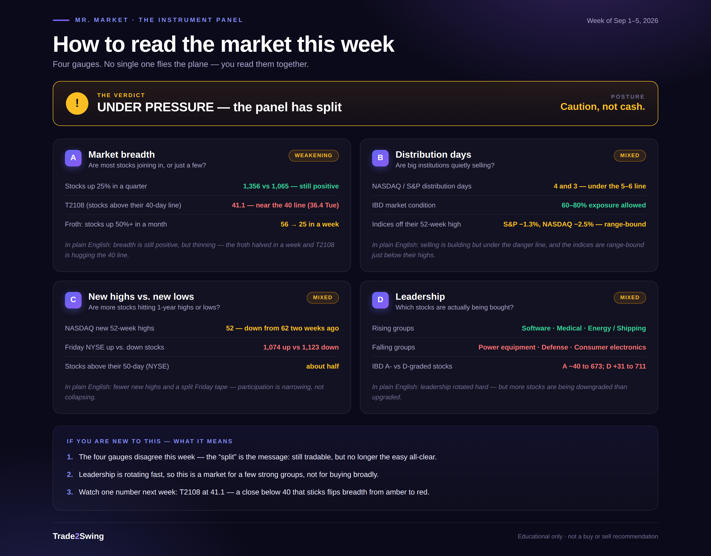

# The Number We Were Watching, Broke — Then Healed

*Week of August 31–September 4, 2026*

## 🧭 This Week's Lesson: Stock First, Group Second

Last week's Model Book study is this week's lead, because it changes how you should be scanning the tape right now: **[Leaders Light the Sector](https://trade2swing.com/model-book-2026-05-07-ftnt-crwd-leadership)**.

The short version: on 05/07/2026, $FTNT and $CRWD broke out on monster institutional volume while their Security Software group still ranked 30th of 200. The group didn't confirm the move — it followed it, climbing to 9th by this Friday's data. Individual stock momentum lit the fuse; the group ranking was the smoke, not the spark. I've codified this as **[House Rule 02 — Stock First, Group Second](https://trade2swing.com/rules#stock-first)**, and it's now how I track leadership weekly on the **[Mr. Market — Leadership](https://trade2swing.com/mr-market-leadership)** page.

Why it matters this week specifically: the group that ran on those two names is *still* sitting at 9th of 200 four months later — the leadership hasn't just held, the market has kept paying for it. That's the backdrop for everything below.

## 📊 Snapshot

The market stayed **under pressure** — same regime as last week, but the number we said would flip it, T2108, actually broke below 40 this week (as low as 36.4 on Tuesday) before closing Friday at 41.1. Quarterly breadth still favors longs (1,356 vs. 1,065), which is why this isn't a defensive call yet. Monthly breadth collapsed to dead even (114 vs. 110, from 256 vs. 90 a week ago) — a real deceleration. Distribution is building quietly while both indexes sit within 3% of their highs, which is why this stays selective rather than aggressive. The number to watch next week is the same one: a Friday close under 40 on T2108, not just an intraweek dip, is what turns this to defense.

## 🎯 The Four-Instrument Read

**A — [Market breadth](https://trade2swing.com/mr-market-breadth.html): WARNING.** The primary signal (stocks up 25%+ in a quarter, 1,356 vs. 1,065) still favors longs. But the 1-month version cratered to near-parity, and T2108 — stocks above their 40-day line — actually traded under 40 for three straight sessions (39.2 → 36.4 → 39.1) before closing the week at 41.1. That's the first real test of the line since this pullback began, and it passed, barely.

**B — [Distribution & follow-through](https://trade2swing.com/mr-market-distribution.html): WARNING.** NASDAQ sits at 4 distribution days, the S&P ticked up to 3 — both still under the 5–6 cluster that would force a regime change. But both indexes are within 1.3–2.5% of their 52-week highs while this selling builds. That's the dangerous shape: supply meeting demand with nothing on the price chart yet to warn you. The 50-day still sits above the 200-day — the long-term trend hasn't cracked.

**C — [New highs vs. new lows](https://trade2swing.com/mr-market-highs-lows.html): WEAKENING.** Friday's NASDAQ advance-decline line was modestly positive (2,253 vs. 2,125); NYSE's was modestly negative (1,074 vs. 1,123). That NASDAQ-over-NYSE gap is itself the signal — this is a narrower, growth-led tape, not a broad one. The net new-high count on NASDAQ flipped negative into Tuesday's low before recovering into Friday.

**D — [Leadership](https://trade2swing.com/mr-market-leadership.html): MIXED.** Software groups still dominate the top of the rankings — Security Software 9th, Enterprise Software 8th, Hardware 6th — down slightly from seven groups in the top 25 last week, but the theme hasn't broken. The fastest risers, though, are speculative: Finance-Crypto rocketed from 135th to 21st, Cannabis from 119th to 19th. That's froth, not foundation — trade it smaller, if at all.

## 📚 Sector Momentum

*Directional, not cap-weighted — NASDAQ groups skew small-cap.*

| Group | Rank now | 3 wks ago | 6 wks ago |
|---|---|---|---|
| Compsftwr-Secur | 9 | 4 | 7 |
| Compsftwr-Enterprise | 8 | 10 | 117 |
| Med-Research | 10 | 32 | 39 |
| Med-Revenubio | 14 | 82 | 97 |
| Finance-Crypto | 21 | 135 | 135 |
| Cannabis | 19 | 85 | 119 |

Security Software cooled slightly (4th → 9th) but is holding inside the top 10 — exactly the group $FTNT and $CRWD lit up in May. Biotech is re-accelerating fast: Med-Research and Med-Revenubio both climbed from the bottom third of 200 groups to the top 15 in six weeks. Meanwhile the NASDAQ-listed technology cohort averaged roughly +2.8% for the week versus the cap-weighted index's +0.4% — more stocks participating than the index alone suggests, which is constructive beneath a flat-looking tape.

## 🔭 Monster Footprints

*44 names this week; this export carries tickers only, no price or volume — so no structure calls, theme grouping only. Always for study, never a tip.*

**Biotech/pharma dominates** — 13 of the 44 names: $SMMT · $EPRX · $VSTM · $CTMX · $TYRA · $MMED · $BHC · $TARS · $BLTE · $MLYS · $PTN · $NDRA · $FRVO. That's a direct match to this week's sector table above — Med-Research and Med-Revenubio both surging. $TARS also appears on IBD's 50 Best Price % Change list this week (+9.1%), which is real corroboration, not coincidence.

**Energy/metals:** $SLB · $CRK · $GOLD · $REPX · $MXC.

**Fintech/financial:** $HOOD · $VBNK · $RPAY · $CURR.

**Consumer:** $AOUT · $WWW · $SMPL · $HELE.

**Industrial/EV/security:** $CNH · $TITN · $NX · $DPRO · $FMC · $EOSE · $CHPT · $STDN · $BYRN · $CAMP · $DELL — and $VRNS, a cybersecurity name, which corroborates this week's lead story about Security Software leadership.

Six symbols I can't confidently identify — $ASST, $IRD, $MRX, $FCUV, $KYIV, $AGMB — are listed as unidentified rather than guessed.

**These are volume-and-price footprints, not setups.** A monster week usually leaves a name extended. Study them; don't chase them.

## 📅 Watch, Ready & Earnings

Full lists live here, always for study, never as a buy or sell recommendation:

- **[Watch / Ready / IPO Radar](https://trade2swing.com/watch-ready-lists)**
- **[Upcoming earnings](https://trade2swing.com/weekly-earnings)**
- **[Full Model Book](https://trade2swing.com/model-book.html)**

## 🗓️ Housekeeping

The gate hasn't changed: **under pressure, selective** — fewer new longs, smaller size, tighter stops, protect what's working. This week did answer last week's open question, though: T2108 didn't just approach 40, it traded through it for three sessions before recovering. That's not nothing — it's a preview of what a real breakdown looks like, and it means the margin for error next time is smaller. The single number to watch: a **Friday close** under 40 on T2108 — not an intraweek dip — is what would flip this to defense. On the upside, a re-acceleration in the quarterly breadth ratio alongside expanding new highs would upgrade this back toward a confirmed uptrend.

---

**Disclaimer:** This is not a buy or sell recommendation. All content on Trade2Swing — including market summaries, watch lists, charts, earnings data, and the Model Book — is published for educational and informational purposes only. Trading and investing in stocks involves substantial risk, including the possible loss of capital. Past performance and historical chart examples do not guarantee future results. Always do your own research and consider consulting a licensed financial advisor before making any investment decision. You are solely responsible for your own decisions.

**CAN SLIM® trademark.** CAN SLIM® is a registered trademark of Investor's Business Daily, Inc. "CANSLIM" is used here as the common shorthand for the same methodology. Trade2Swing is an independent publication and is not affiliated with, endorsed by, or sponsored by Investor's Business Daily, Inc.

**Attribution.** The market monitor is a member resource of the Stock Bee community, created by Pradeep Bonde (Easy Guru). Trade2Swing is independent and unaffiliated.
